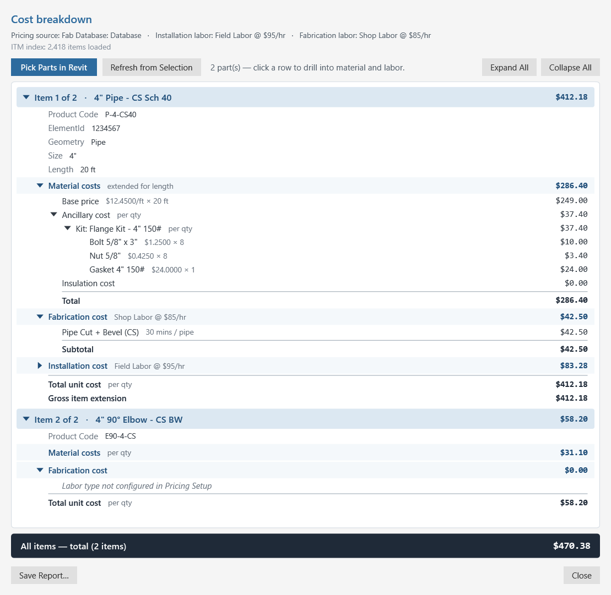
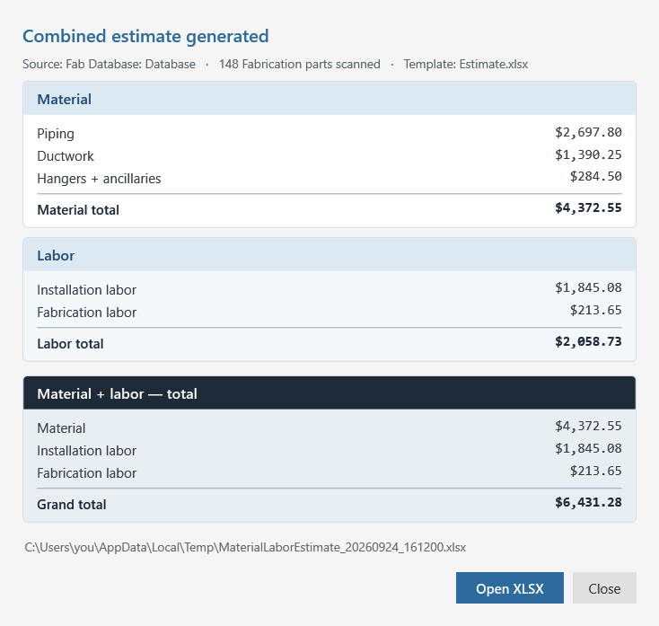
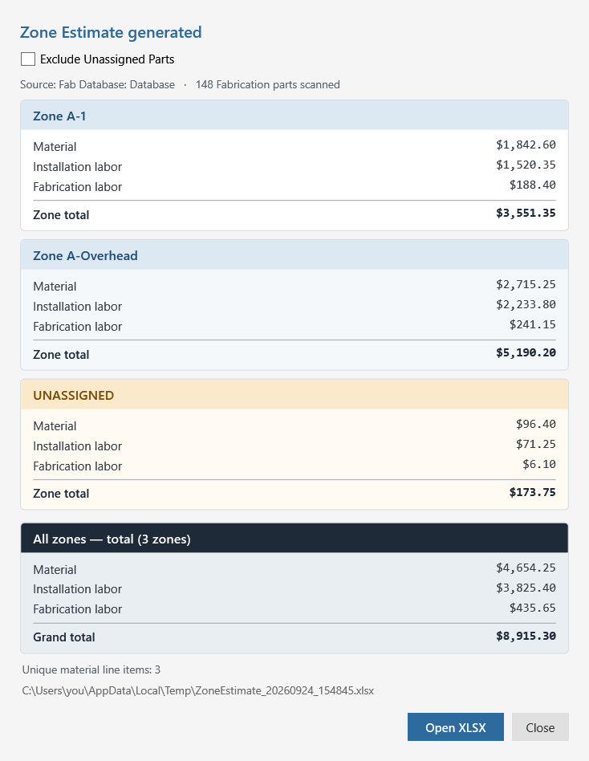

# User guide

A walkthrough of every part of the add-in. Read top-to-bottom on first use; jump to a section later.

> **Disclaimer.** This code is provided by Autodesk for evaluation purposes only, as an example of what is possible with the Autodesk platform and APIs. THIS CODE IS NOT INTENDED FOR USE IN PRODUCTION. Autodesk makes no representations, warranties, or commitments about the code. This code is not fully tested and may include errors or faults that may cause total data loss or system failure.

---

## What this add-in is for

Pricing and estimating **Autodesk MEP Fabrication parts** inside Revit, using the same data Fabrication itself prices from:

- **Material** list prices from the Fabrication database (`supplier.map`, plus `Material.MAP` for sheet-metal duct) or from your own CSV price lists.
- **Labor** time from the database's labor tables (`etimes.map` for installation, `ftimes.map` for fabrication), priced at hourly rates you set.

On top of that sit the estimates (material, labor, combined, and per zone) and the zone tools, which split a model into areas and vertical bands so each one is priced separately.

What changes in your model:

- **Pricing Sync / Pricing Wipe** write rate values into the parameters you map in Pricing Setup.
- **Sync Zones** writes each part's zone into the **Estimate Zone** parameter.
- **Estimate Zones → Setup** adds the zone parameters, Area Plans and bindings; **Manage Bands** writes band values onto Areas; **Show Volumes** adds see-through boxes that **Hide Volumes** removes.
- Pricing Setup is saved on the project's Project Information.

The estimate and breakdown commands only read the model; they write files (CSV / XLSX / TXT) to disk.

---

## Ribbon

After installation, look for the **Estimating Tools** tab in the Revit ribbon. Its **Estimating** panel holds the pricing and estimate tools on the left, a separator, then the zone tools:

| Button | What it does |
|---|---|
| **Pricing Setup** | Choose price sources, labor rates, target parameters and an optional Excel template. |
| **Pricing Sync** | Write M / E / F rates onto every Fabrication part. |
| **Pricing Wipe** | Reset those rate parameters to $0. |
| **Cost Breakdown** | Per-part breakdown of material, ancillaries and labor. |
| **Generate Estimate** ▾ | Material Estimate · Labor Estimate · Material + Labor Estimate · Zone Estimate. |
| **Estimate Zones** ▾ | Setup · Sync Zones · Diagnose Zones · Manage Bands · Show Volumes · Hide Volumes. |
| **Zone Boundary** | Sketch zone boundary lines (Revit's Area Boundary tool). |
| **Place Zone** | Place a zone Area inside a closed boundary (Revit's Area tool). |

---

# One-time project setup — rate parameters

Pricing Sync writes three values onto each Fabrication part, into **project parameters you create**:

| Rate | Meaning |
|---|---|
| **M-Rate** | Material cost ($) |
| **E-Rate** | Installation (erection) labor ($, or hours — see below) |
| **F-Rate** | Fabrication labor ($, or hours) |

Create them once per project (or in your template) via **Manage → Project Parameters → Add**:

- Type **Number**, **Currency** or **Text**.
- Instance parameters, bound to the MEP Fabrication categories you want priced — **MEP Fabrication Pipework**, **Ductwork** and **Hangers**.
- Any names you like; you pick them in Pricing Setup.

Only map the ones you need. The estimates don't use these parameters — they price from the database directly — so you can skip this step if you only want estimates.

---

# Pricing Setup

Opens the configuration dialog. Everything here is saved with the project when you click **Save**.

Sources can be active at the same time. Rates are looked up in order — **Fab Database first, then CSV files in list order** — and the first value found for each rate wins.

### Use Fab Database

Tick it and **Browse…** to your Fabrication **Database** folder (the one containing `supplier.map`). The add-in reads:

- `supplier.map` — list prices for pipe, fittings and valves.
- `Material.MAP` — sheet-metal duct pricing (weight × $/lb by material and gauge).
- `etimes.map` / `ftimes.map` — installation and fabrication labor time tables.
- `cost.map` — labor types for the dropdowns.
- The `.ITM` files under the database — per-part labor tables and ancillary kits.

### Labor rates

Pick an **Installation** and a **Fabrication** labor type. Picking one from the dropdown pre-fills its $/hr from `cost.map`; you can overwrite the rate or type your own name. The rates you see are the ones used.

### Include Loose ancillaries

Off by default, matching Fabrication's Cost Breakdown for pipe: "Loose" ancillaries such as Class A duct sealants are tracked but not billed. Turn it on for duct-heavy projects where your Fabrication setup does bill them.

### Use CSV file(s)

Add one or more CSV price lists. Each needs a header row with the columns `Product Code`, `M-Rate`, `E-Rate`, `F-Rate`; parts are matched on their **Product Code**. Excel users: save as **CSV (UTF-8)** — `.xlsx` isn't read here.

### Estimate template (optional)

An Excel file the estimates fill in instead of their plain output — see [Excel estimate templates](#excel-estimate-templates). **Generate sample…** writes a ready-to-use template; **Learn more…** explains the placeholders; **Clear** goes back to the plain output.

### Revit parameter mapping

Pick the project parameter that receives each rate. Values are written rounded to 2 decimal places. Pricing Sync stops before writing anything if a mapped parameter is missing or the wrong type.

**Write E-Rate + F-Rate as labor hours instead of dollars** — writes labor hours (dollars ÷ hourly rate) instead of dollar cost. M-Rate stays in dollars. If a labor rate is 0, that side is skipped with a warning.

---

# Pricing Sync

Walks every Fabrication part in the project, looks up its rates from the configured sources, and writes them to the mapped parameters. Straight pipe is priced by its length.

The **Pricing Sync result** dialog shows how many parts were updated, priced by length, had no rates in any source, or had no writable target parameter.

- **Parts with no list price.** When a part has no price in `supplier.map` or on its ITM, M-Rate is set to the sum of its ancillary kit (bolts, nuts, gaskets…) and the part is flagged. Click **Show N missing-cost ITM(s)** to select them and zoom to them.
- **"Missing Cost" markers (optional).** If your project has a family named **Missing Cost** loaded, Sync drops one at each flagged part and removes them again once a price turns up. Without the family, this step is skipped with a note.
- **Native pipe accessories.** Revit pipe-accessory families (not Fabrication parts) with a **Product Code** parameter get an M-Rate from `supplier.map` plus their ITM's ancillary kit. Labor isn't computed for them.

Re-run Pricing Sync whenever the model or prices change.

---

# Pricing Wipe

Writes **0** (or blank, for Text parameters) to the mapped M / E / F parameters on **every** Fabrication part — for example before sending the model to someone who shouldn't see costs. A confirmation lists the parameters first; the default answer is **No**.

Pricing Sync puts the values back any time.

---

# Cost Breakdown

A per-part cost breakdown in the same shape as Fabrication ESTmep's **Cost Breakdown** view. Needs Pricing Setup with **Use Fab Database** enabled.

- Opens on whatever you have selected: Fabrication parts, plus native pipe accessories with a Product Code.
- **Pick Parts in Revit** — pick parts from the model; **Refresh from Selection** — re-read the current selection.
- Each part is a blue band with its total. Click a row to drill into it:
  - **Material costs** — list price (per foot for pipe and duct), each ancillary and kit with its unit price × quantity, and the material total.
  - **Fabrication cost** and **Installation cost** — each labor table with its time and cost, and the subtotal.
- **Expand All / Collapse All**, and **Save Report…** writes the same breakdown as a text file.
- The dark bar at the bottom is the total of everything listed.

The window is modeless — keep it open while you work in the model.

---

# Generate Estimate

Four estimates, all priced straight from the configured sources (they don't read the M / E / F parameters, so Pricing Sync isn't required first):

| Command | What you get | File |
|---|---|---|
| **Material Estimate** | Material BOM rolled up by Product Code, grouped Piping / Ductwork / Hangers + ancillaries. | CSV, or your template |
| **Labor Estimate** | Installation and fabrication labor rolled up by labor table. Needs **Use Fab Database**. | CSV, or your template |
| **Material + Labor Estimate** | Both, with a grand total. | XLSX (Combined / Materials / Labor sheets), or your template |
| **Zone Estimate** | Material and labor per Estimate Zone — see [Run the zone estimate](#run-the-zone-estimate). | XLSX |

Each opens a results window with the totals:

*Material + Labor results (sample numbers).*

- Each group is its own colored card with a subtotal.
- The dark card at the bottom holds the overall total and stays visible while the cards above it scroll.
- The line under the heading shows the pricing source, the number of parts scanned and the template used; notes (like parts with no price match) sit under the total, and warnings show in amber.
- **Open CSV / Open XLSX** opens the full file. Files are saved in your Windows temp folder — save a copy elsewhere to keep one.

## Excel estimate templates

Point Pricing Setup at an `.xlsx` file and the Material, Labor and Material + Labor estimates fill it in instead of writing their plain output — so your logo, fonts, column widths and number formats carry into every estimate.

The quickest start is **Pricing Setup → Generate sample…**. It writes a styled four-sheet template (Cover, Materials, Labor, Instructions) that works as-is; add your logo, adjust anything, save it somewhere stable, and select it.

How templates work:

- A cell containing exactly `{{Name}}` is replaced with a value — for example `{{ProjectName}}`, `{{Date}}`, `{{MaterialTotal}}`, `{{GrandTotal}}`. The placeholder must be the **only** thing in the cell.
- A row of `{{Materials.Field}}` (or `{{Labor.Field}}`) cells is a table: the tool writes one row per line starting there, copying that row's formatting, and **replaces everything below it** — so put totals above a table, never below.
- The sheet named **Instructions** is never filled, so the sample's placeholder reference stays readable.
- A Material-only or Labor-only estimate leaves the other side's values blank. A misspelled placeholder stays as literal text, so typos are easy to spot.

The sample's **Instructions** sheet lists every placeholder and table column.

---

# Estimate Zones

Zones let you price parts of the model separately. Each zone is a Revit **Area** in a dedicated **Estimating Zones** Area Scheme. Bands split one zone footprint into stacked vertical slices, and each slice is estimated as its own zone: Area `A` with bands 0' to 10' and 10' to 14' becomes zones **A-1** and **A-2**.

Areas without bands work on their own level: the whole level is one zone.

The workflow: **Setup** once → sketch Areas with **Zone Boundary** and **Place Zone** → **Manage Bands** where needed → **Sync Zones** → check with **Show Volumes** and **Diagnose Zones** → **Zone Estimate**.

## One-time setup

1. Run **Estimate Zones → Setup**.
2. If the **Estimating Zones** Area Scheme is missing, create it once by hand — Revit doesn't let add-ins create Area Schemes. The dialog lists the steps: **Architecture → Room & Area ▾ → Area and Volume Computations → Area Schemes → New**, and name it exactly **Estimating Zones**.
3. Click **Set up missing pieces**. This binds the **Estimate Zone** parameter to MEP Fabrication Pipework, Ductwork and Hangers, adds the band parameters to Areas, and creates an **Estimate Zones — \<Level\>** Area Plan for each level.

The shared-parameter definitions are kept in `%APPDATA%\EstimatingTools\EstimatingTools-SharedParameters.txt`.

## Sketch the zone footprint

Sketch each footprint once and place one Area; all of its bands live on that one Area.

1. Open the Estimating Zones Area Plan for the level, e.g. **Estimate Zones — Level 1**.
2. Click **Zone Boundary** (Revit's Area Boundary tool) and sketch a closed boundary.
3. Click **Place Zone** (Revit's Area tool) and click inside the boundary.
4. Name the Area in the Properties palette, e.g. `A`. Band names are built from this name.

Both buttons only work in an Area Plan under the Estimating Zones scheme. Don't sketch the same footprint a second time to get another band — Revit rejects overlapping Areas in one scheme on one level.

## Add bands

Select the Area and run **Estimate Zones → Manage Bands** (with nothing selected, it asks you to pick one). Each row becomes one zone.

1. Click **+ Add band** for each slice. A new band starts where the previous one ends.
2. Enter **Bottom** and **Top** for each band. These are absolute elevations — use the Level elevations listed at the bottom of the dialog as your reference. `10`, `10'` and `10'-6"` all work. Bands can't overlap.
3. Check the names. They fill in grey as `A-1`, `A-2` in row order. Type over a name to use your own (it turns dark); clear the box to go back to the automatic name. Names can't contain `: ; , ' "`.
4. Click **Save**.

Band 1 is stored in the Area's **Zone Bottom / Top Elevation** parameters and the rest in **Zone Extra Bands**. You can see them in Properties, but edit them through Manage Bands.

## Tag parts with Sync Zones

Run **Estimate Zones → Sync Zones** after any change to zones, bands or the model. It writes one zone name into the **Estimate Zone** parameter of every Fabrication pipe, duct and hanger, and reports how many were tagged and how many were left UNASSIGNED. The Zone Estimate reads these tags, so re-sync before estimating.

### How a part's zone is decided

Every part gets exactly one zone, so zone totals can't double-count. The zone is judged at the pipe or duct centerline, so valve handwheels, actuators and hanger rods never push a part into the band above.

| Situation | Zone it gets |
|---|---|
| Straight pipe or duct | Centerline sampled every 6"; the zone holding the most length wins |
| Sloped line crossing a band boundary | The zone holding most of its length |
| Run crossing a zone line in plan | The zone holding most of its length |
| Fitting, valve or flange | Votes from each connection point plus the fitting's center |
| Hanger | The point on its host pipe's centerline under the hanger |
| Centerline exactly on a band boundary | The upper band: 10'-0" goes to A-2 |
| Exact 50/50 split | The zone at the middle of the part |
| Point inside two zones | The more specific: a band beats a whole-level zone, a narrower band beats a taller one |
| Mostly outside every zone | UNASSIGNED |
| Area with no bands | Parts on that Area's Level inside its outline |

## Run the zone estimate

Run **Generate Estimate → Zone Estimate** after Sync Zones. It prices every tagged part and totals material and labor per zone, so each band gets its own card. It needs a pricing source in Pricing Setup.

*Zone Estimate results (sample numbers).*

| Card | What it shows |
|---|---|
| Zone card (blue) | Material, installation labor and fabrication labor for one zone, ending in a bold **Zone total**. Cards alternate white and pale blue. |
| UNASSIGNED (amber) | Parts that are mostly outside every zone. |
| All zones — total (dark) | The sum of every card shown, ending in the **Grand total**. Its title counts the zones included. It stays pinned at the bottom while the zone cards scroll. |

Labor lines appear only when Pricing Setup has labor configured.

- **Exclude Unassigned Parts** removes the UNASSIGNED card and takes it out of the grand total; the total card's title then says "UNASSIGNED excluded". Leave it off until Diagnose Zones shows nothing is missing.
- **Open XLSX** opens the spreadsheet: the zone summary on top, then every priced line by zone. It always matches the checkbox.

## Check your work

- **Show Volumes** draws a see-through box for each band; open a 3D view to walk around them. Each zone name keeps the same color between runs, and running it again replaces the previous boxes.
- **Hide Volumes** removes only the boxes Show Volumes created. The boxes are real model elements, so hide them before publishing the model.
- **Diagnose Zones** lists every UNASSIGNED part with **Show in view**. It reads the saved tags, so run Sync Zones first.

## Editing later and limits

Re-open **Manage Bands** on the Area to change bands, then run **Sync Zones** again.

- **Renaming the Area** renames its automatic band names. Typed names stay as they are.
- **Removing the last band** isn't possible once an Area has bands, because Revit can't blank those parameters. To cover the whole level again, make one band from this Level to the next.
- **"Band parameters aren't bound"** means setup is incomplete. Run **Estimate Zones → Setup** and click **Set up missing pieces**.
- **Can't pick the Area?** Open its Estimating Zones Area Plan first. Areas can't be selected in 3D views.

---

## Troubleshooting

- **"Configure Pricing Setup first."** — no price source is saved in this project yet. Open Pricing Setup, enable Fab Database and/or CSV, and click Save.
- **Most parts come out with no price.** The Database folder isn't the one the parts came from, or the parts have no Product Code. Pricing Sync's **Show missing-cost ITM(s)** and the estimates' "no price match" count point at them.
- **Pricing Sync stops with a parameter error.** A mapped parameter doesn't exist on Fabrication parts or isn't Number / Currency / Text. Fix the parameter or the mapping in Pricing Setup.
- **Zone Boundary / Place Zone say they only work from an Area Plan.** Open one of the **Estimate Zones — \<Level\>** plans (run **Estimate Zones → Setup** if there are none).
- **Zone Estimate says no priced parts were found.** Run Sync Zones first, and check Pricing Setup.

---

## License

MIT with the Autodesk evaluation disclaimer above — see [LICENSE](../LICENSE).
